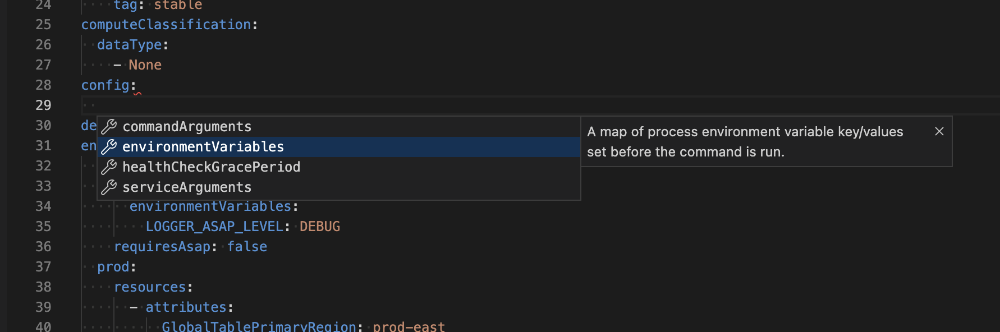
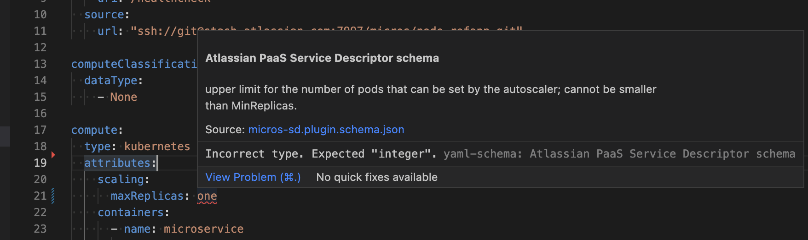
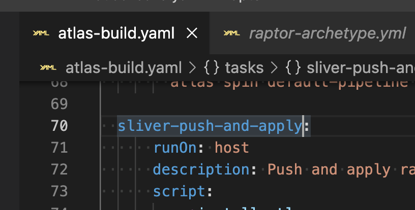
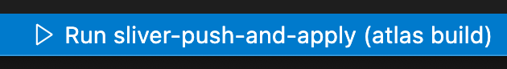

# VSCode plugin

## Installation

Download the plugin from [here](https://statlas.prod.simple-container.com/dev/platform/vscode-plugin.vsix).
[index.md](index.md)
To install from the terminal, run `code --install-extension vscode-plugin.vsix`

You must also have the [Redhat YAML plugin](https://marketplace.visualstudio.com/items?itemName=redhat.vscode-yaml) to support YAML validation.

## Usage

The VS Code Plugin validates standard Atlassian JSON/YAML files and auto-completion for their attributes.

Currently supported files include:

- Micros Service Descriptors
- Bitbucket Pipeline Config
- Welder Config
- Spinnaker Default Pipelines
- Archetype Descriptors
- Poco Policies
- Renovate config

# Task Runner
Simply open the "Welder Tasks" sidebar explorer to view the welder tasks in the current project.
Click any to run them.

# Status Bar
Whilst you have an welder.yml editor open, if you click on the task name, a status bar item appears allowing you to run that specific task.

# Contribute
You can find the source here: https://bitbucket.org/atlassianlabs/platform-vscode-plugin/src/main/